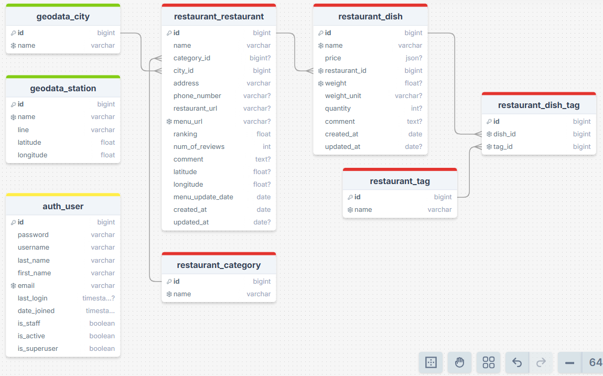

# Sampo: проект по поиску ресторанов и еды в Санкт-Петербурге

Сампо — в карельском народном эпосе волшебная мельница, обладающая магической силой и являющаяся источником счастья, благополучия и изобилия.

## Требования

- python3.12
- make

## Используемые инструменты

       

## Переменные окружения

ENV = local | test | prod

- Переменные окружения: /env/.env.$(ENV)
- Специфичные для окружения настройки: /core/settings/$(ENV).py

## Команды

### Запуск проекта

Для ENV=local:

```bash
# Клонировать проект
git clone https://github.com/kooznitsa/sampo.git

# Создать файлы окружения
cd sampo
cp env/.env.local.example env/.env.local
cp env/.env.test.example env/.env.test

# Запустить контейнеры Docker
make build

# Создать индексы Elasticsearch
make elastic
```

Для ENV=prod:

```bash
# Клонировать проект
git clone https://github.com/kooznitsa/sampo.git

# Создать файлы окружения
cd sampo
cp env/.env.local.example env/.env.prod
cp env/.env.test.example env/.env.test

# Запустить контейнеры Docker
make build ENV=prod

# Создать индексы Elasticsearch
make elastic ENV=prod
```

### Установка зависимостей локально (если необходимо)

```bash
python3.12 -m venv .venv
source .venv/bin/activate
pip install poetry
poetry install --no-root
```

### Релиз

```bash
git checkout dev
git pull

chmod +x release.sh
./release.sh v1.0.0  # изменить версию

git checkout dev
git merge main
```

## Структура базы данных (основные таблицы)



## API

Документация: /api/v1/swagger/

Без авторизации доступны GET-запросы.

## Админка

Админка: /admin/

Доступ в админку в режиме просмотра:

- логин: guest
- пароль: sampopass
